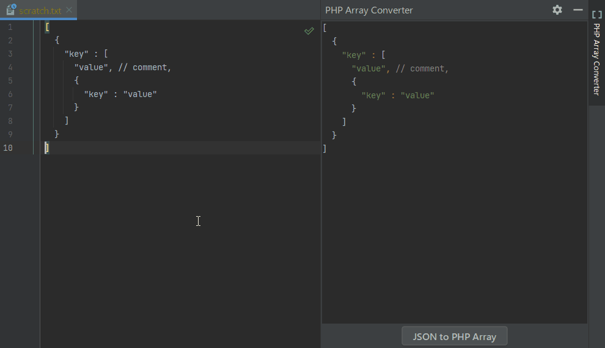

# php-array-converter

**PHP Array Converter plugin for IntelliJ IDEs.**  
**Adds support for mutual conversion between PHP Array and JSON.**

## Features

- First, open the tool window.
  - View > Tool Windows > PHP Array Converter
  - Right-click menu in the editor > PHP Array Converter

- If there is a PHP Array or JSON around the editor cursor,  
  it will be displayed in the tool window.

- Click the convert button in the tool window.
  - JSON to PHP Array
  - PHP Array to JSON

- Cannot convert if variables or function calls are included.  
  The literal types allowed are:
  - string
  - int
  - float
  - boolean
  - null

## Demo

## Settings

File > Settings > Tools > PHP Array Converter
